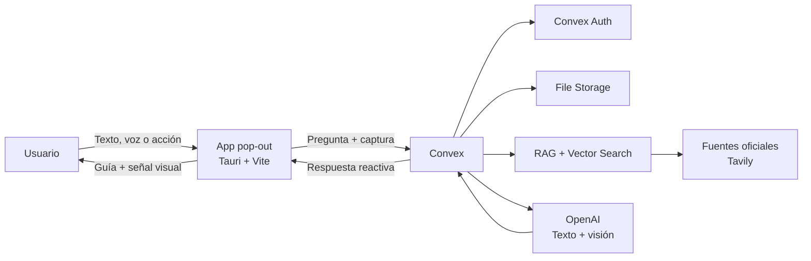

<div align="center">
  

  # Michi Teach

  **Tu michi profe personal para aprender software profesional mientras lo usas.**

  Una aplicación de escritorio *pop-out* que entiende lo que ves, escucha lo que necesitas y te guía en tiempo real sin sacarte de tu flujo de trabajo.

  [](https://tauri.app/)
  [](https://www.convex.dev/)
  [](https://vite.dev/)
  [](https://www.rust-lang.org/)

  Proyecto desarrollado para **The Next Craft Hackathon**.
</div>

---

## ¿Qué es Michi Teach?

Aprender Blender, DaVinci Resolve, Photoshop u otra herramienta profesional suele implicar detenerse, cambiar de ventana y buscar un tutorial que quizá ya no coincide con la interfaz actual.

**Michi Teach convierte ese proceso en una conversación contextual.** Vive en una ventana flotante, siempre disponible al costado de tu pantalla. A partir de una captura del entorno de trabajo y una pregunta por texto —con entrada por voz dentro de la visión del producto— identifica la aplicación, consulta información relevante y devuelve una explicación breve, precisa y adaptada a lo que el usuario está viendo.

> “Michi, ¿cómo añado un keyframe en Blender?”

La experiencia está pensada para activarse desde la propia app o mediante un atajo global: captura el contexto visual, encuentra el control adecuado y responde sin romper la concentración del usuario.

## La experiencia

1. Abres tu herramienta profesional, por ejemplo **Blender**.
2. Invocas a Michi Teach desde la ventana flotante o el atajo configurado.
3. Escribes o dictas exactamente lo que quieres hacer.
4. Michi analiza la captura, reconoce el software y recupera documentación relacionada.
5. Recibes una guía accionable y, cuando corresponde, la ubicación visual del elemento que debes usar.

Michi no pretende operar el programa por ti: quiere enseñarte a dominarlo. 🐾

## Convex: el corazón de Michi Teach

[Convex](https://www.convex.dev/) es la pieza central de la arquitectura. No funciona únicamente como base de datos: coordina el flujo completo entre la aplicación de escritorio, el contexto visual, la IA y la respuesta que recibe el usuario.

- **Estado reactivo en tiempo real:** sincroniza conversaciones y mensajes sin administrar WebSockets manualmente.
- **Backend serverless:** concentra queries, mutations, actions y endpoints HTTP en una sola plataforma.
- **Autenticación:** protege las conversaciones y vincula cada sesión con su usuario mediante Convex Auth.
- **Almacenamiento de capturas:** guarda imágenes de forma segura y genera URLs para mostrarlas en el historial.
- **Orquestación de IA:** prepara el contexto, identifica la herramienta, consulta el sistema RAG y procesa la respuesta del modelo multimodal.
- **Búsqueda vectorial:** recupera fragmentos relevantes de documentación utilizando embeddings de 1536 dimensiones.
- **Progreso de aprendizaje:** mantiene temas completados, nivel detectado, errores y actividad por aplicación.
- **Tareas programadas:** refresca periódicamente la base de conocimiento desde fuentes autorizadas.

El resultado es un backend compacto, reactivo y escalable, especialmente adecuado para una experiencia educativa que debe responder mientras el usuario trabaja.

## Arquitectura



### Flujo de una consulta contextual

1. La app recibe una pregunta y una captura del espacio de trabajo.
2. Convex valida la sesión y almacena el mensaje y la imagen.
3. El modelo de visión identifica la aplicación visible.
4. El motor RAG busca documentación oficial y recurre a una búsqueda web controlada si la cobertura local es insuficiente.
5. OpenAI genera una explicación y, si existe un control concreto, coordenadas normalizadas para señalarlo.
6. Convex persiste el resultado y lo sincroniza con la interfaz.

## Tecnologías

| Capa | Tecnología | Función |
| --- | --- | --- |
| Aplicación de escritorio | **Tauri 2 + Rust** | Ventana nativa ligera, siempre visible, colapsable y con integración a la bandeja del sistema. |
| Interfaz | **Vite + JavaScript + CSS** | Experiencia conversacional rápida y diseño del panel flotante. |
| Backend principal | **Convex** | Datos, tiempo real, lógica serverless, almacenamiento, autenticación y tareas programadas. |
| Inteligencia artificial | **OpenAI** | Conversación, análisis de capturas, identificación de herramientas y embeddings. |
| Recuperación de conocimiento | **Convex Vector Search + Tavily** | RAG híbrido basado en documentación y fuentes verificables. |
| Contenido | **Marked + DOMPurify** | Renderizado seguro de respuestas en Markdown. |
| Interfaz visual | **Lucide Icons** | Iconografía consistente y accesible. |

El catálogo de conocimiento contempla Windows 11, Microsoft Excel y Word, DaVinci Resolve, Adobe Premiere Pro, Photoshop, After Effects, Illustrator, Blender, CapCut, Figma, Unity, Unreal Engine, Visual Studio Code y Notion.

## Estado del proyecto

Michi Teach se encuentra en desarrollo como integración para **The Next Craft Hackathon**.

### Disponible actualmente

- Aplicación de escritorio flotante, transparente y siempre visible.
- Modo expandido y colapsado, bandeja del sistema y temas claro/oscuro.
- Registro, inicio de sesión e historial de conversaciones con Convex Auth.
- Consultas por texto y adjunto manual de capturas.
- Detección visual de la herramienta y respuestas contextuales con OpenAI.
- Persistencia de capturas en Convex File Storage.
- RAG híbrido, búsqueda vectorial y actualización programada de conocimiento.
- Respuestas en tiempo real y señalización mediante coordenadas visuales.

### Próximos pasos

- Captura automática de la ventana activa.
- Atajo global configurable para invocar la ayuda desde cualquier aplicación.
- Entrada y reproducción de voz de extremo a extremo.
- Overlay sobre la aplicación activa para señalar directamente cada control.
- Rutas de aprendizaje y métricas de progreso más completas.

## Ejecutar el proyecto

### Requisitos

- [Node.js](https://nodejs.org/) 20 o superior.
- [pnpm](https://pnpm.io/) 11.
- [Rust](https://rustup.rs/) estable.
- Dependencias de [Tauri](https://tauri.app/start/prerequisites/) para tu sistema operativo.
  - **Windows:** Visual Studio Build Tools con “Desarrollo para el escritorio con C++” y WebView2.
  - **macOS:** Xcode Command Line Tools.
  - **Linux:** WebKitGTK y dependencias de Tauri.

### Instalación

```bash
git clone <URL_DEL_REPOSITORIO>
cd Lumi
corepack enable
pnpm install --frozen-lockfile
```

Crea `.env.local` a partir de `.env.example` y configura la URL de tu deployment:

```env
VITE_CONVEX_URL=https://tu-deployment.convex.cloud
```

Después, configura en el deployment de Convex las variables privadas que utiliza el backend:

```text
OPENAI_API_KEY
OPENAI_MODEL       # opcional; por defecto gpt-4o-mini
TAVILY_API_KEY     # necesaria para la ingesta y el fallback web del RAG
```

Inicia Convex en una terminal:

```bash
pnpm convex:dev
```

Y la aplicación de escritorio en otra:

```bash
pnpm start
```

En Windows también puedes utilizar el lanzador con validación de requisitos:

```powershell
powershell -ExecutionPolicy Bypass -File .\scripts\start.ps1
```

## Comandos útiles

| Comando | Descripción |
| --- | --- |
| `pnpm start` | Ejecuta Michi Teach como aplicación de escritorio en desarrollo. |
| `pnpm dev` | Inicia únicamente la interfaz con Vite. |
| `pnpm build` | Compila la interfaz para producción. |
| `pnpm desktop:build` | Genera el ejecutable y los instaladores nativos. |
| `pnpm convex:dev` | Inicia y sincroniza el backend de Convex. |
| `pnpm convex:deploy` | Despliega las funciones de Convex. |

Los instaladores se generan en `src-tauri/target/release/bundle/`.

## Estructura del repositorio

```text
Lumi/
├── src/                  # Interfaz de la aplicación pop-out
│   └── assets/           # Identidad visual de Michi Teach
├── src-tauri/            # Shell nativo, ventana, bandeja e iconos
├── backend/convex/       # Backend principal, Auth, RAG y almacenamiento
├── convex/               # Módulos Convex auxiliares del cliente
└── scripts/              # Utilidades para desarrollo local
```

## Principios del producto

- **Contexto antes que respuestas genéricas:** Michi observa el entorno antes de enseñar.
- **Fuentes antes que suposiciones:** si no encuentra información oficial suficiente, lo comunica.
- **Aprender sin abandonar el flujo:** la ayuda aparece donde ocurre el trabajo.
- **Guía, no piloto automático:** el usuario conserva el control y desarrolla la habilidad.
- **Una personalidad cercana:** tecnología profesional explicada por un profe paciente, directo y un poquito michi.

---

<div align="center">
  <strong>Michi Teach</strong><br />
  Tu curiosidad pone la pregunta. Michi pone la patita en el lugar correcto. 🐾
</div>
